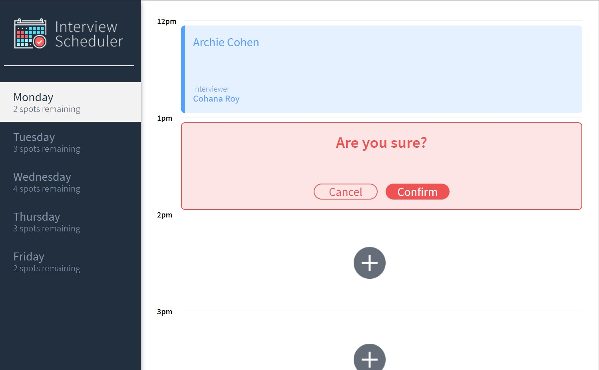

# Interview Scheduler

The Interview scheduler (shown below) is a React App which allows for booking times to meet with an interviewer.


## Booking an Interview:

Interviews may be scheduled by selecting an available timeslot. The user enters their name and selects from one of the available interviewers for that day.


## Feedback/Edits/Deletions

Once the interview request has been accepted the user will see the previously empty interview slot will contain the information that was provided by them.

The user has the ability to edit the particulars ogf their interview request by clicking on the edit icon that appears when hovering over their timeslot.

The user also has the ability to delete their interview request altogether if desired. A confirmation dialog give the user the opportunity to cancel the deletion of their interview request.



## Dependencies

- classnames
- normalize.css"
- react
- react-dom
- react-scripts
- axios

## Getting Started

Install dependencies with `npm install`.

## Running Webpack Development Server

```sh
npm start
```

## Running Jest Test Framework

```sh
npm test
```

## Running Storybook Visual Testbed

```sh
npm run storybook
```

App runs at: http://localhost:8080/
